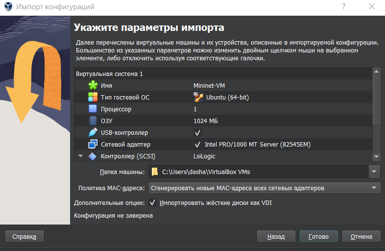

---
## Front matter
lang: ru-RU
title: Лабораторная работа №1
subtitle: Введение в Mininet
author:
  - Беличева Д. М.
institute:
  - Российский университет дружбы народов, Москва, Россия

## i18n babel
babel-lang: russian
babel-otherlangs: english

## Formatting pdf
toc: false
toc-title: Содержание
slide_level: 2
aspectratio: 169
section-titles: true
theme: metropolis
header-includes:
 - \metroset{progressbar=frametitle,sectionpage=progressbar,numbering=fraction}
---

# Информация

## Докладчик

:::::::::::::: {.columns align=center}
::: {.column width="70%"}

  * Беличева Дарья Михайловна
  * студентка
  * Российский университет дружбы народов
  * [1032216453@pfur.ru](mailto:1032216453@pfur.ru)
  * <https://dmbelicheva.github.io/ru/>

:::
::: {.column width="25%"}

:::
::::::::::::::

## Цель работы

Основной целью работы является развёртывание в системе виртуализации
(например, в VirtualBox) mininet, знакомство с основными командами для работы с Mininet через командную строку и через графический интерфейс.

## Выполнение лабораторной работы

{#fig:001 width=70%}

## Выполнение лабораторной работы

{#fig:002 width=70%}

## Выполнение лабораторной работы

{#fig:003 width=70%}

## Выполнение лабораторной работы

{#fig:004 width=70%}

## Выполнение лабораторной работы

{#fig:005 width=60%}

## Выполнение лабораторной работы

{#fig:006 width=70%}

## Выполнение лабораторной работы

{#fig:007 width=40%}

## Выполнение лабораторной работы

{#fig:008 width=80%}

## Выполнение лабораторной работы

{#fig:009 width=55%}

## Выполнение лабораторной работы

{#fig:010 width=70%}

## Выполнение лабораторной работы

{#fig:011 width=70%}

## Выполнение лабораторной работы

{#fig:012 width=40%}

## Выполнение лабораторной работы

{#fig:013 width=55%}

## Выполнение лабораторной работы

{#fig:014 width=35%}

## Выполнение лабораторной работы

{#fig:015 width=70%}

## Выводы

В результате выполнения данной лабораторной работы я развёрнула mininet в системе виртуализации
VirtualBox, а также ознакомилась с основными командами для работы с Mininet через командную строку и через графический интерфейс.

## Список литературы

1. Mininet [Электронный ресурс]. Mininet Project Contributors. URL: http://mini
net.org/ (дата обращения: 11.12.2024).