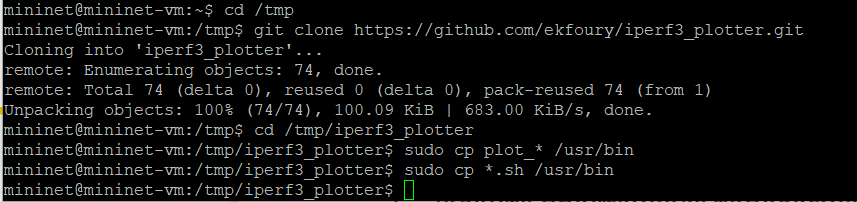

---
## Front matter
lang: ru-RU
title: Лабораторная работа № 2
subtitle: Измерение и тестирование пропускной способности сети. Интерактивный эксперимент
author:
  - Беличева Д. М.
institute:
  - Российский университет дружбы народов, Москва, Россия

## i18n babel
babel-lang: russian
babel-otherlangs: english

## Formatting pdf
toc: false
toc-title: Содержание
slide_level: 2
aspectratio: 169
section-titles: true
theme: metropolis
header-includes:
 - \metroset{progressbar=frametitle,sectionpage=progressbar,numbering=fraction}
---

# Информация

## Докладчик

:::::::::::::: {.columns align=center}
::: {.column width="70%"}

  * Беличева Дарья Михайловна
  * студентка
  * Российский университет дружбы народов
  * [1032216453@pfur.ru](mailto:1032216453@pfur.ru)
  * <https://dmbelicheva.github.io/ru/>

:::
::: {.column width="25%"}

:::
::::::::::::::

## Цель работы

Основной целью работы является знакомство с инструментом для измерения
пропускной способности сети в режиме реального времени — iPerf3, а также
получение навыков проведения интерактивного эксперимента по измерению
пропускной способности моделируемой сети в среде Mininet.

## Задание

1. Установить на виртуальную машину mininet iPerf3 и дополнительное программное обеспечения для визуализации и обработки данных.
2. Провести ряд интерактивных экспериментов по измерению пропускной
способности с помощью iPerf3 с построением графиков.

# Выполнение лабораторной работы

## Установка необходимого программного обеспечения

{#fig:001 width=55%}

## Установка необходимого программного обеспечения

{#fig:002 width=70%}

## Установка необходимого программного обеспечения

{#fig:003 width=70%}

## Интерактивные эксперименты

{#fig:004 width=60%}

## Интерактивные эксперименты

{#fig:005 width=70%}

## Интерактивные эксперименты

{#fig:006 width=30%}

## Интерактивные эксперименты

{#fig:007 width=70%}

## Интерактивные эксперименты

{#fig:008 width=70%}

## Интерактивные эксперименты

{#fig:009 width=40%}

## Интерактивные эксперименты

{#fig:010 width=40%}

## Интерактивные эксперименты

{#fig:011 width=30%}

## Интерактивные эксперименты

{#fig:012 width=30%}

## Интерактивные эксперименты

{#fig:013 width=35%}

## Интерактивные эксперименты

{#fig:014 width=30%}

## Интерактивные эксперименты

{#fig:015 width=30%}

## Интерактивные эксперименты

{#fig:016 width=70%}

## Интерактивные эксперименты

{#fig:017 width=70%}

## Интерактивные эксперименты

{#fig:018 width=50%}

## Выводы

В результате выполнения данной лабораторной работы я познакомилась с инструментом для измерения
пропускной способности сети в режиме реального времени — iPerf3, а также
получила навыки проведения интерактивного эксперимента по измерению
пропускной способности моделируемой сети в среде Mininet.

## Список литературы

1. Mininet [Электронный ресурс]. Mininet Project Contributors. URL: http://mininet.org/ (дата обращения: 17.11.2024).
2. IPerff [Электронный ресурс]. URL: https://iperf.fr/.