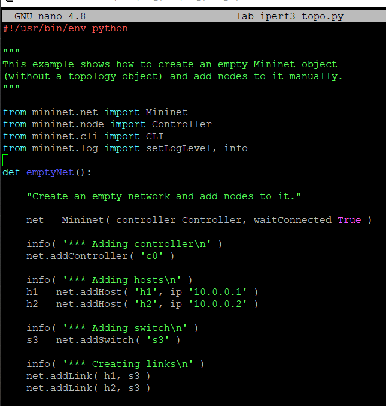
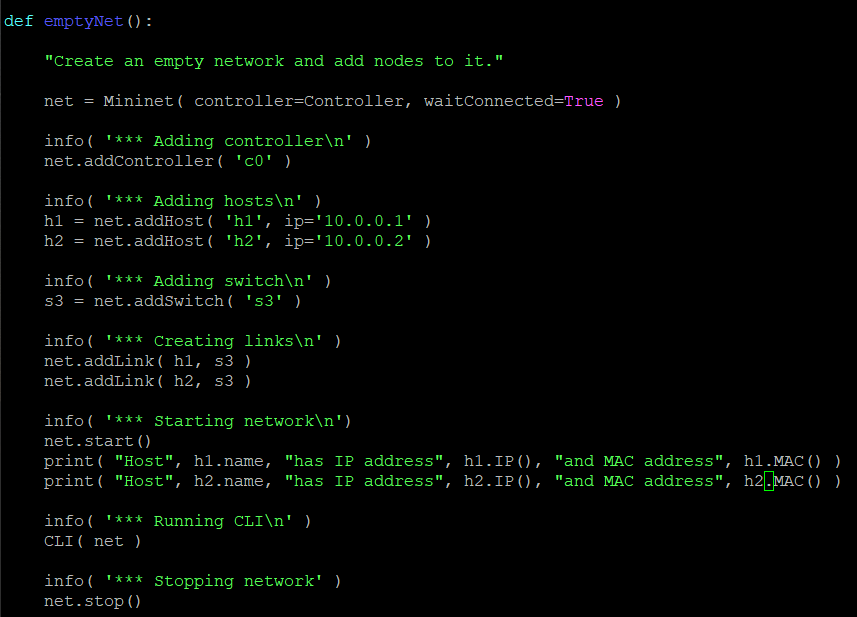
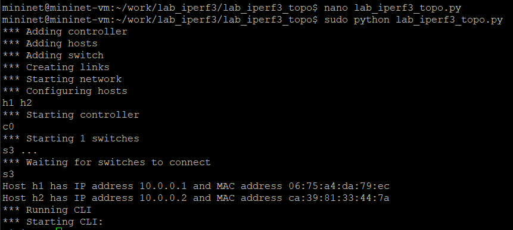
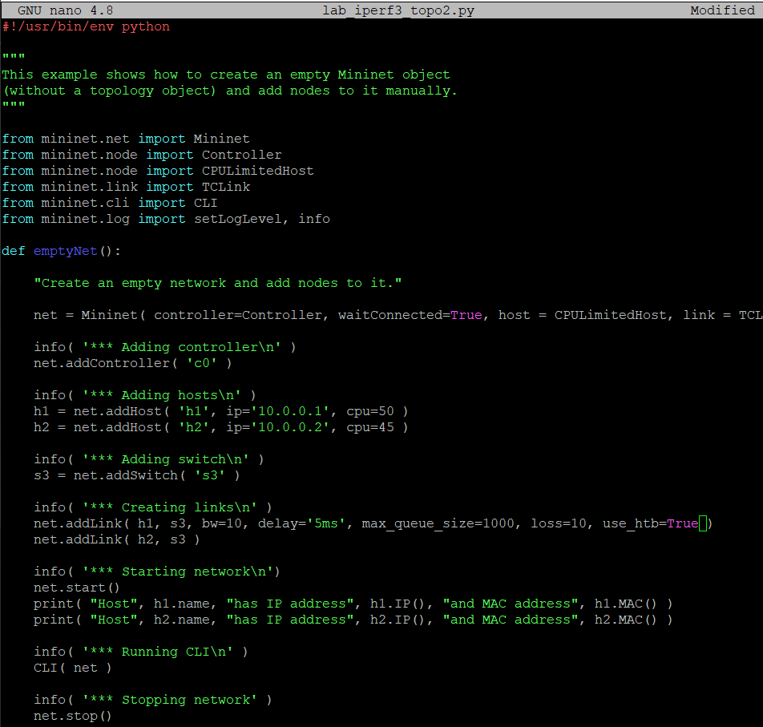
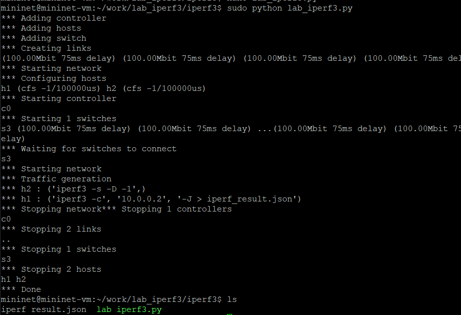
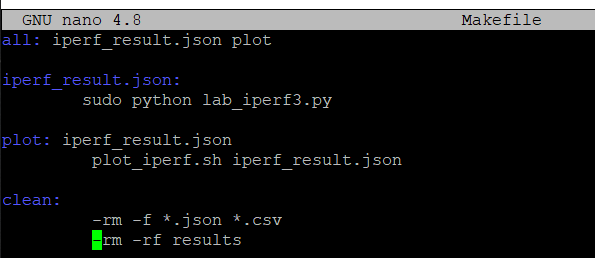
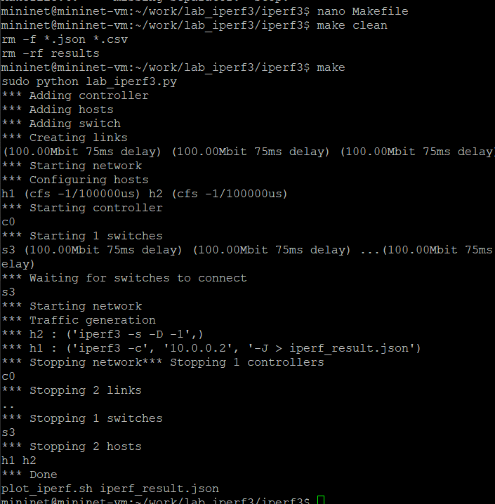

---
## Front matter
title: "Лабораторная работа № 3"
subtitle: "Измерение и тестирование пропускной способности сети. Воспроизводимый эксперимент"
author: "Беличева Дарья Михайловна"

## Generic otions
lang: ru-RU
toc-title: "Содержание"

## Bibliography
bibliography: bib/cite.bib
csl: pandoc/csl/gost-r-7-0-5-2008-numeric.csl

## Pdf output format
toc: true # Table of contents
toc-depth: 2
lof: true # List of figures
lot: false # List of tables
fontsize: 12pt
linestretch: 1.5
papersize: a4
documentclass: scrreprt
## I18n polyglossia
polyglossia-lang:
  name: russian
  options:
	- spelling=modern
	- babelshorthands=true
polyglossia-otherlangs:
  name: english
## I18n babel
babel-lang: russian
babel-otherlangs: english
## Fonts
mainfont: IBM Plex Serif
romanfont: IBM Plex Serif
sansfont: IBM Plex Sans
monofont: IBM Plex Mono
mathfont: STIX Two Math
mainfontoptions: Ligatures=Common,Ligatures=TeX,Scale=0.94
romanfontoptions: Ligatures=Common,Ligatures=TeX,Scale=0.94
sansfontoptions: Ligatures=Common,Ligatures=TeX,Scale=MatchLowercase,Scale=0.94
monofontoptions: Scale=MatchLowercase,Scale=0.94,FakeStretch=0.9
mathfontoptions:
## Biblatex
biblatex: true
biblio-style: "gost-numeric"
biblatexoptions:
  - parentracker=true
  - backend=biber
  - hyperref=auto
  - language=auto
  - autolang=other*
  - citestyle=gost-numeric
## Pandoc-crossref LaTeX customization
figureTitle: "Рис."
tableTitle: "Таблица"
listingTitle: "Листинг"
lofTitle: "Список иллюстраций"
lotTitle: "Список таблиц"
lolTitle: "Листинги"
## Misc options
indent: true
header-includes:
  - \usepackage{indentfirst}
  - \usepackage{float} # keep figures where there are in the text
  - \floatplacement{figure}{H} # keep figures where there are in the text
---

# Цель работы

Основной целью работы является знакомство с инструментом для измерения
пропускной способности сети в режиме реального времени — iPerf3, а также
получение навыков проведения воспроизводимого эксперимента по измерению
пропускной способности моделируемой сети в среде Mininet.

# Задание

1. Воспроизвести посредством API Mininet эксперименты по измерению пропускной способности с помощью iPerf3.
2. Построить графики по проведённому эксперименту.

# Теоретическое введение

Mininet[@mininet] -- это эмулятор компьютерной сети. Под компьютерной сетью подразумеваются простые компьютеры — хосты, коммутаторы, а так же OpenFlow-контроллеры. С помощью простейшего синтаксиса в примитивном интерпретаторе команд можно разворачивать сети из произвольного количества хостов, коммутаторов в различных топологиях и все это в рамках одной виртуальной машины(ВМ). На всех хостах можно изменять сетевую конфигурацию, пользоваться стандартными утилитами(ifconfig, ping) и даже получать доступ к терминалу. На коммутаторы можно добавлять различные правила и маршрутизировать трафик.

iPerf3[@iperf] представляет собой кроссплатформенное клиент-серверное приложение с открытым исходным кодом,
которое можно использовать для измерения пропускной способности между
двумя конечными устройствами.
iPerf3 может работать с транспортными протоколами TCP, UDP и SCTP:

- TCP и SCTP:
  - измеряет пропускную способность;
  - позволяет задать размер MSS/MTU;
  - отслеживает размер окна перегрузки TCP (CWnd).
  
- UDP:
  - измеряет пропускную способность;
  - измеряет потери пакетов;
  - измеряет колебания задержки (jitter);
  - поддерживает групповую рассылку пакетов (multicast).

# Выполнение лабораторной работы

С помощью API Mininet создадим простейшую топологию сети, состоящую
из двух хостов и коммутатора с назначенной по умолчанию mininet сетью
10.0.0.0/8.

В каталоге /work/lab_iperf3 для работы над проектом создадим подкаталог lab_iperf3_topo и скопируем в него файл с примером скрипта
mininet/examples/emptynet.py, описывающего стандартную простую
топологию сети mininet (рис. [-@fig:001]).

{#fig:001 width=70%}

Изучим содержание скрипта lab_iperf3_topo.py (рис. [-@fig:002]).

В нем написан скрипт по созданию простейшей топологии из двух хостов h1 и h2, а также коммутатора s3 и контроллера c0. В начале файла видим импорт необходимых библиотек.

{#fig:002 width=70%}

Основные элементы:

- addSwitch(): добавляет коммутатор в топологию и возвращает имя коммутатора;
- ddHost(): добавляет хост в топологию и возвращает имя хоста;
- addLink(): добавляет двунаправленную ссылку в топологию (и возвращает ключ ссылки; ссылки в Mininet являются двунаправленными, если не указано иное);
- Mininet: основной класс для создания и управления сетью;
- start(): запускает сеть;
- pingAll(): проверяет подключение, пытаясь заставить все узлы пинговать друг друга;
- stop(): останавливает сеть;
- net.hosts: все хосты в сети;
- dumpNodeConnections(): сбрасывает подключения к/от набора узлов;
- setLogLevel( 'info' | 'debug' | 'output' ): устанавливает уровень вывода Mininet по умолчанию; рекомендуется info.

Запустим скрипт создания топологии lab_iperf3_topo.py и посмотрим ее основные параметры (рис. [-@fig:003]).

{#fig:003 width=70%}

Внесем в скрипт lab_iperf3_topo.py изменение, позволяющее вывести
на экран информацию обоих хостов сети, а именно имя хоста, его IP-адрес, MAC-адрес (рис. [-@fig:004]).

{#fig:004 width=70%}

Здесь:

- IP() возвращает IP-адрес хоста или определенного интерфейса;
- MAC() возвращает MAC-адрес хоста или определенного интерфейса.

Проверим корректность отработки изменённого скрипта (рис. [-@fig:005]).

{#fig:005 width=70%}

Действительно, нам вывелась информация об IP и mac адресах хостов.

Mininet предоставляет функции ограничения производительности и изоляции с помощью классов CPULimitedHost и TCLink. Добавим в скрипт
настройки параметров производительности (рис. [-@fig:006]).

В скрипте lab_iperf3_topo2.py изменим строку описания сети, указав
на использование ограничения производительности и изоляции. Также измении функцию задания параметров виртуального хоста h1, указав, что ему будет выделено 50% от общих
ресурсов процессора системы. Аналогичным образом для хоста h2 зададим долю выделения ресурсов
процессора в 45%.
В скрипте изменим функцию параметров соединения между хостом h1 и коммутатором s3.
А именно добавим двунаправленный канал с характеристиками пропускной способности, задержки и потерь:

- параметр пропускной способности (bw) выражается числом в Мбит;
- задержка (delay) выражается в виде строки с заданными единицами
измерения (например, 5ms, 100us, 1s);
- потери (loss) выражаются в процентах (от 0 до 100);
- параметр максимального значения очереди (max_queue_size) выражается в пакетах;
- параметр use_htb указывает на использование ограничителя интенсивности входящего потока Hierarchical Token Bucket (HTB)

{#fig:006 width=70%}

Запустим на отработку сначала скрипт lab_iperf3_topo2.py, затем
lab_iperf3_topo.py и сравним результат (рис. [-@fig:007]). Увидим, что в первом случае у нас создалась сеть с настроенными параметрами, а во втором случае дефолтная сеть без этих параметров.

{#fig:007 width=70%}

Построим графики по проводимому эксперименту.

Сделаем копию скрипта lab_iperf3_topo2.py и поместим его в подкаталог iperf (рис. [-@fig:008]).

{#fig:008 width=70%}

Изменим код в скрипте lab_iperf3.py так, чтобы (рис. [-@fig:009]).:

- на хостах не было ограничения по использованию ресурсов процессора;
- каналы между хостами и коммутатором были по 100 Мбит/с с задержкой 75 мс, без потерь, без использования ограничителей пропускной
способности и максимального размера очереди.
- После функции старта сети опишем запуск на хосте h2 сервера iPerf3, а на хосте h1 запуск с задержкой в 10 секунд клиента iPerf3 с экспортом
результатов в JSON-файл, закомментируем строки, отвечающие за запуск
CLI-интерфейса:

{#fig:009 width=70%}

Запустим на отработку скрипт lab_iperf3.py (рис. [-@fig:010]).

{#fig:010 width=70%}

Построим графики из получившегося JSON-файла. Создадим Makefile для проведения всего эксперимента. В Makefile пропишем запуск скрипта эксперимента, построение графиков и очистку каталога от результатов (рис. [-@fig:011]).

{#fig:011 width=70%}

Проверьте корректность отработки Makefile (рис. [-@fig:012]).

{#fig:012 width=70%}

# Выводы

В результате выполнения данной лабораторной работы я познакомилась с инструментом для измерения
пропускной способности сети в режиме реального времени — iPerf3, а также
получила навыки проведения воспроизводимого эксперимента по измерению
пропускной способности моделируемой сети в среде Mininet.

# Список литературы{.unnumbered}

::: {#refs}
:::
