---
## Front matter
lang: ru-RU
title: Лабораторная работа № 4
subtitle: Эмуляция и измерение задержек в глобальных сетях
author:
  - Беличева Д. М.
institute:
  - Российский университет дружбы народов, Москва, Россия

## i18n babel
babel-lang: russian
babel-otherlangs: english

## Formatting pdf
toc: false
toc-title: Содержание
slide_level: 2
aspectratio: 169
section-titles: true
theme: metropolis
header-includes:
 - \metroset{progressbar=frametitle,sectionpage=progressbar,numbering=fraction}
---

# Информация

## Докладчик

:::::::::::::: {.columns align=center}
::: {.column width="70%"}

  * Беличева Дарья Михайловна
  * студентка
  * Российский университет дружбы народов
  * [1032216453@pfur.ru](mailto:1032216453@pfur.ru)
  * <https://dmbelicheva.github.io/ru/>

:::
::: {.column width="25%"}


:::
::::::::::::::

## Цель работы

Основной целью работы является знакомство с NETEM — инструментом для
тестирования производительности приложений в виртуальной сети, а также
получение навыков проведения интерактивного и воспроизводимого экспериментов по измерению задержки и её дрожания (jitter) в моделируемой сети
в среде Mininet.

## Задание

1. Задайте простейшую топологию, состоящую из двух хостов и коммутатора
с назначенной по умолчанию mininet сетью 10.0.0.0/8.
2. Проведите интерактивные эксперименты по добавлению/изменению задержки, джиттера, значения корреляции для джиттера и задержки, распределения
времени задержки в эмулируемой глобальной сети.
3. Реализуйте воспроизводимый эксперимент по заданию значения задержки
в эмулируемой глобальной сети. Постройте график.
4. Самостоятельно реализуйте воспроизводимые эксперименты по изменению
задержки, джиттера, значения корреляции для джиттера и задержки, распределения времени задержки в эмулируемой глобальной сети. Постройте
графики.

# Выполнение лабораторной работы

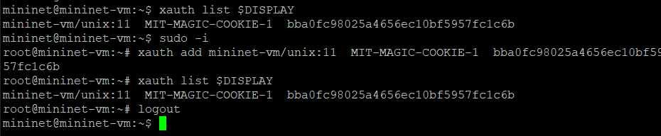{#fig:001 width=70%}

## Выполнение лабораторной работы

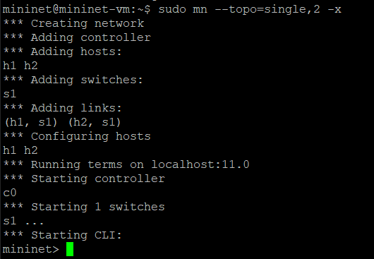{#fig:002 width=70%}

## Выполнение лабораторной работы

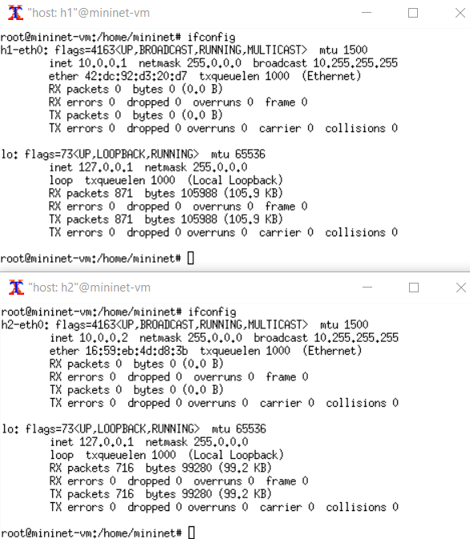{#fig:003 width=55%}

## Выполнение лабораторной работы

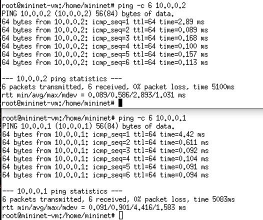{#fig:004 width=55%}

## Добавление/изменение задержки в эмулируемой глобальной сети

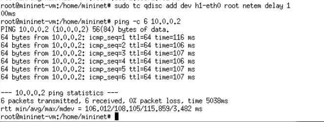{#fig:005 width=70%}

## Добавление/изменение задержки в эмулируемой глобальной сети

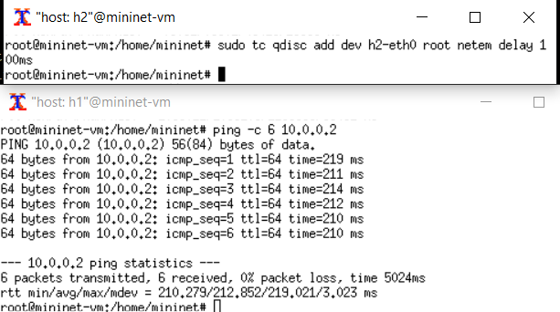{#fig:006 width=70%}

## Изменение задержки в эмулируемой глобальной сети

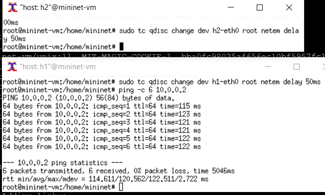{#fig:007 width=70%}

## Восстановление исходных значений (удаление правил) задержки в эмулируемой глобальной сети

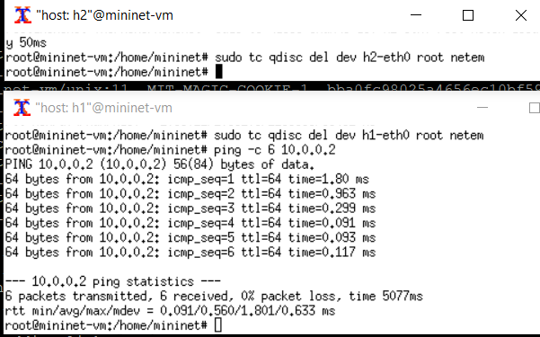{#fig:008 width=70%}

## Добавление значения дрожания задержки в интерфейс подключения к эмулируемой глобальной сети

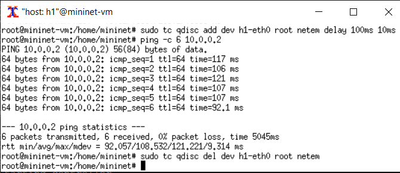{#fig:009 width=70%}

## Добавление значения корреляции для джиттера и задержки в интерфейс подключения к эмулируемой глобальной сети

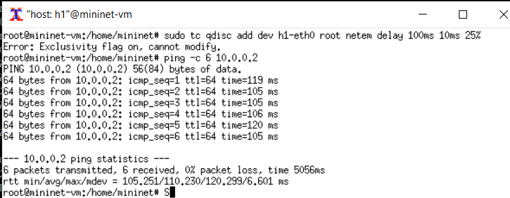{#fig:010 width=70%}

## Распределение задержки в интерфейсе подключения к эмулируемой глобальной сети

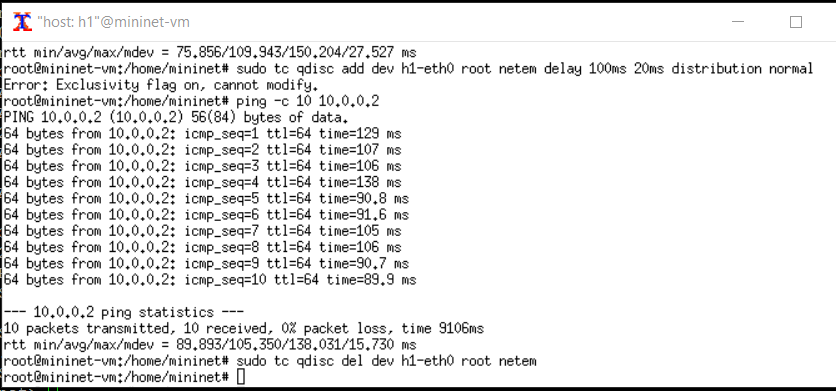{#fig:011 width=70%}

## Воспроизведение экспериментов. Добавление задержки для интерфейса, подключающегося к эмулируемой глобальной сети

```Py
14 def emptyNet():
15
16 "Create an empty network and add nodes to it."
18 net = Mininet( controller=Controller,  waitConnected=True )
20 info( '*** Adding controller\n' )
21 net.addController( 'c0' )
23 info( '*** Adding hosts\n' )
24 h1 = net.addHost( 'h1', ip='10.0.0.1' )
25 h2 = net.addHost( 'h2', ip='10.0.0.2' )
```

## Воспроизведение экспериментов. Добавление задержки для интерфейса, подключающегося к эмулируемой глобальной сети

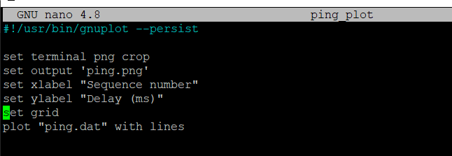{#fig:012 width=70%}

## Воспроизведение экспериментов. Добавление задержки для интерфейса, подключающегося к эмулируемой глобальной сети

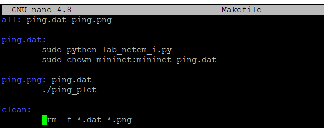{#fig:013 width=70%}

## Воспроизведение экспериментов. Добавление задержки для интерфейса, подключающегося к эмулируемой глобальной сети

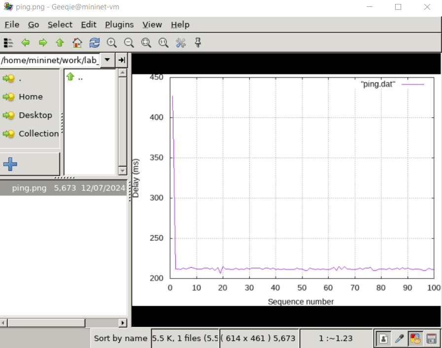{#fig:014 width=55%}

## Воспроизведение экспериментов. Добавление задержки для интерфейса, подключающегося к эмулируемой глобальной сети

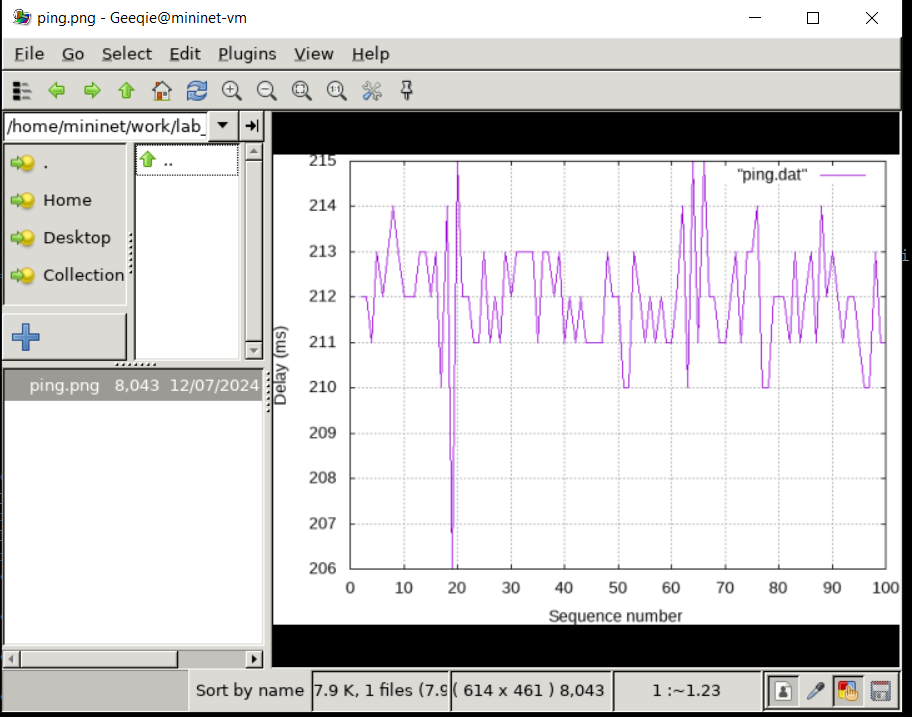{#fig:015 width=55%}

## Воспроизведение экспериментов. Добавление задержки для интерфейса, подключающегося к эмулируемой глобальной сети

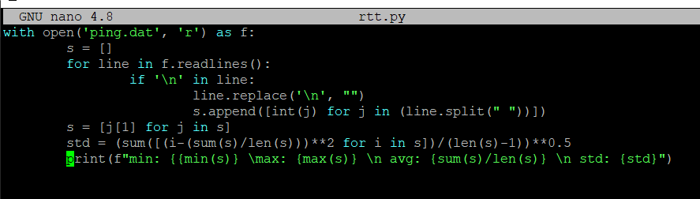{#fig:016 width=70%}

## Воспроизведение экспериментов. Добавление задержки для интерфейса, подключающегося к эмулируемой глобальной сети

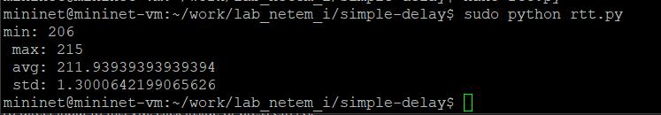{#fig:017 width=70%}

## Выводы

В результате выполнения данной лабораторной работы я познакомилась с NETEM -- инструментом для
тестирования производительности приложений в виртуальной сети, а также
получила навыки проведения интерактивного и воспроизводимого экспериментов по измерению задержки и её дрожания (jitter) в моделируемой сети
в среде Mininet.

## Список литературы

1. Mininet [Электронный ресурс]. Mininet Project Contributors. URL: http://mininet.org/ (дата обращения: 17.11.2024).
