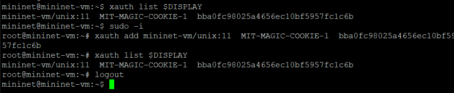
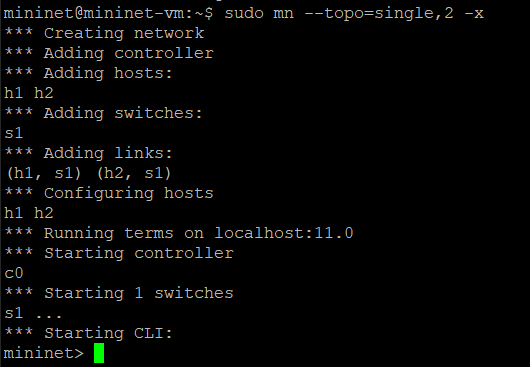
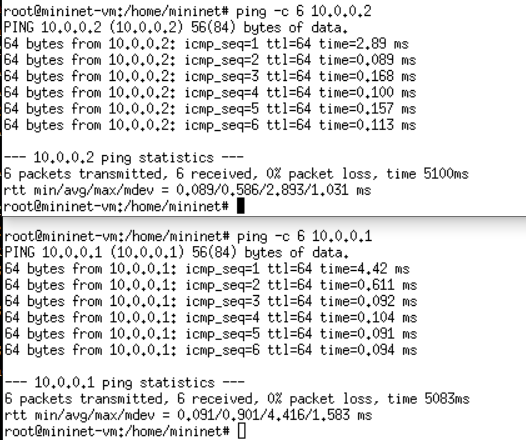
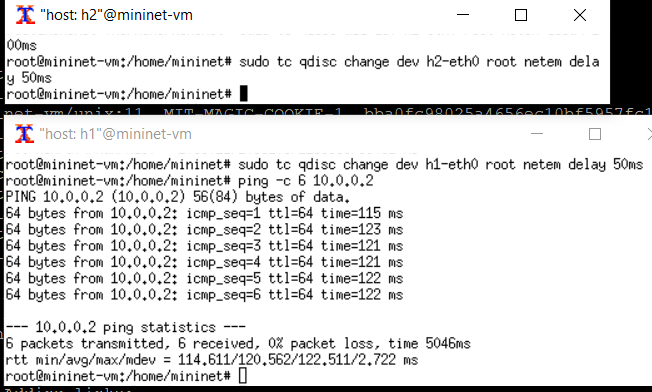
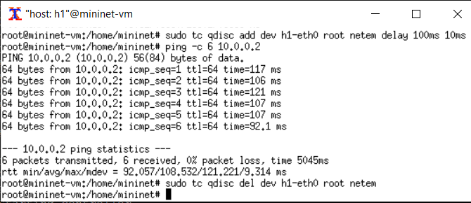
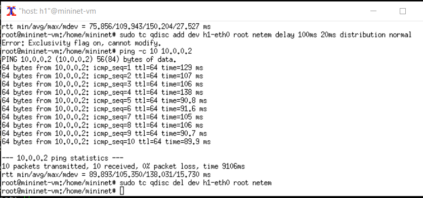
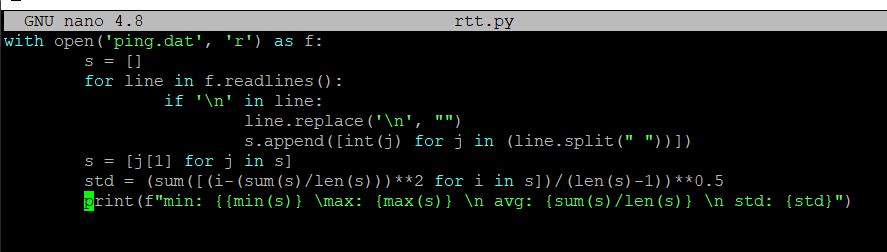
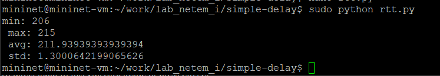

---
## Front matter
title: "Лабораторная работа № 4"
subtitle: "Эмуляция и измерение задержек в глобальных сетях"
author: "Беличева Дарья Михайловна"

## Generic otions
lang: ru-RU
toc-title: "Содержание"

## Bibliography
bibliography: bib/cite.bib
csl: pandoc/csl/gost-r-7-0-5-2008-numeric.csl

## Pdf output format
toc: true # Table of contents
toc-depth: 2
lof: true # List of figures
lot: false # List of tables
fontsize: 12pt
linestretch: 1.5
papersize: a4
documentclass: scrreprt
## I18n polyglossia
polyglossia-lang:
  name: russian
  options:
	- spelling=modern
	- babelshorthands=true
polyglossia-otherlangs:
  name: english
## I18n babel
babel-lang: russian
babel-otherlangs: english
## Fonts
mainfont: IBM Plex Serif
romanfont: IBM Plex Serif
sansfont: IBM Plex Sans
monofont: IBM Plex Mono
mathfont: STIX Two Math
mainfontoptions: Ligatures=Common,Ligatures=TeX,Scale=0.94
romanfontoptions: Ligatures=Common,Ligatures=TeX,Scale=0.94
sansfontoptions: Ligatures=Common,Ligatures=TeX,Scale=MatchLowercase,Scale=0.94
monofontoptions: Scale=MatchLowercase,Scale=0.94,FakeStretch=0.9
mathfontoptions:
## Biblatex
biblatex: true
biblio-style: "gost-numeric"
biblatexoptions:
  - parentracker=true
  - backend=biber
  - hyperref=auto
  - language=auto
  - autolang=other*
  - citestyle=gost-numeric
## Pandoc-crossref LaTeX customization
figureTitle: "Рис."
tableTitle: "Таблица"
listingTitle: "Листинг"
lofTitle: "Список иллюстраций"
lotTitle: "Список таблиц"
lolTitle: "Листинги"
## Misc options
indent: true
header-includes:
  - \usepackage{indentfirst}
  - \usepackage{float} # keep figures where there are in the text
  - \floatplacement{figure}{H} # keep figures where there are in the text
---

# Цель работы

Основной целью работы является знакомство с NETEM — инструментом для
тестирования производительности приложений в виртуальной сети, а также
получение навыков проведения интерактивного и воспроизводимого экспериментов по измерению задержки и её дрожания (jitter) в моделируемой сети
в среде Mininet.

# Задание

1. Задайте простейшую топологию, состоящую из двух хостов и коммутатора
с назначенной по умолчанию mininet сетью 10.0.0.0/8.
2. Проведите интерактивные эксперименты по добавлению/изменению задержки, джиттера, значения корреляции для джиттера и задержки, распределения
времени задержки в эмулируемой глобальной сети.
3. Реализуйте воспроизводимый эксперимент по заданию значения задержки
в эмулируемой глобальной сети. Постройте график.
4. Самостоятельно реализуйте воспроизводимые эксперименты по изменению
задержки, джиттера, значения корреляции для джиттера и задержки, распределения времени задержки в эмулируемой глобальной сети. Постройте
графики.

# Теоретическое введение

Mininet[@mininet] -- это эмулятор компьютерной сети. Под компьютерной сетью подразумеваются простые компьютеры — хосты, коммутаторы, а так же OpenFlow-контроллеры. С помощью простейшего синтаксиса в примитивном интерпретаторе команд можно разворачивать сети из произвольного количества хостов, коммутаторов в различных топологиях и все это в рамках одной виртуальной машины(ВМ). На всех хостах можно изменять сетевую конфигурацию, пользоваться стандартными утилитами(ifconfig, ping) и даже получать доступ к терминалу. На коммутаторы можно добавлять различные правила и маршрутизировать трафик.

# Выполнение лабораторной работы

Запустим виртуальную среду с mininet. Из основной ОС подключимся к виртуальной машине. В виртуальной машине mininet при необходимости исправим права запуска
X-соединения. Скопируем значение куки (MIT magic cookie)
своего пользователя mininet в файл для пользователя root (рис. [-@fig:001]).

{#fig:001 width=70%}

Задайте простейшую топологию, состоящую из двух хостов и коммутатора
с назначенной по умолчанию mininet сетью 10.0.0.0/8 (рис. [-@fig:002]).

После введения этой команды запустятся терминалы двух хостов, коммутатора и контроллера. Терминалы коммутатора и контроллера можно закрыть.

{#fig:002 width=70%}

На хостах h1 и h2 введем команду ifconfig, чтобы отобразить информацию, относящуюся к их сетевым интерфейсам и назначенным им IP-адресам.
В дальнейшем при работе с NETEM и командой tc будут использоваться
интерфейсы h1-eth0 и h2-eth0 (рис. [-@fig:003]).

{#fig:003 width=70%}

Проверим подключение между хостами h1 и h2 с помощью команды ping
с параметром -c 6 (рис. [-@fig:004]).

{#fig:004 width=70%}

## Добавление/изменение задержки в эмулируемой глобальной сети

На хосте h1 добавим задержку в 100 мс к выходному интерфейсу (рис. [-@fig:005]).

`sudo tc qdisc add dev h1-eth0 root netem delay 100ms`

- sudo: выполнить команду с более высокими привилегиями;
- tc: вызвать управление трафиком Linux;
- qdisc: изменить дисциплину очередей сетевого планировщика;
- add: создать новое правило;
- dev h1-eth0: указать интерфейс, на котором будет применяться правило;
- netem: использовать эмулятор сети;
- delay 100ms: задержка ввода 100 мс.

Проверим, что соединение от хоста h1 к хосту h2 имеет задержку 100 мс,
используя команду ping с параметром -c 6 с хоста h1

{#fig:005 width=70%}

Для эмуляции глобальной сети с двунаправленной задержкой необходимо
к соответствующему интерфейсу на хосте h2 также добавим задержку в 100
миллисекунд (рис. [-@fig:006]).

Проверим, что соединение между хостом h1 и хостом h2 имеет RTT в 200 мс
(100 мс от хоста h1 к хосту h2 и 100 мс от хоста h2 к хосту h1), повторив
команду ping с параметром -c 6 на терминале хоста h1.

{#fig:006 width=70%}

## Изменение задержки в эмулируемой глобальной сети

Изменим задержку со 100 мс до 50 мс для отправителя h1 и для получателя h2 (рис. [-@fig:007]).

Проверим, что соединение от хоста h1 к хосту h2 имеет задержку 100 мс,
используя команду ping с параметром -c 6 с терминала хоста h1.

{#fig:007 width=70%}

## Восстановление исходных значений (удаление правил) задержки в эмулируемой глобальной сети

Восстановим конфигурацию по умолчанию, удалив все правила, применённые к сетевому планировщику соответствующего интерфейса для
отправителя h1 и для получателя h2. Проверим, что соединение между хостом h1 и хостом h2 не имеет явно
установленной задержки, используя команду ping с параметром -c 6 с терминала хоста h1 (рис. [-@fig:008]).

{#fig:008 width=70%}

## Добавление значения дрожания задержки в интерфейс подключения к эмулируемой глобальной сети

Добавим на узле h1 задержку в 100 мс со случайным отклонением 10 мс. Проверим, что соединение от хоста h1 к хосту h2 имеет задержку 100 мс со
случайным отклонением ±10 мс, используя в терминале хоста h1 команду
ping с параметром -c 6.
Восстановим конфигурацию интерфейса по умолчанию на узле h1 (рис. [-@fig:009]).

{#fig:009 width=70%}

## Добавление значения корреляции для джиттера и задержки в интерфейс подключения к эмулируемой глобальной сети

Добавим на интерфейсе хоста h1 задержку в 100 мс с вариацией ±10 мс
и значением корреляции в 25%. Убедимся, что все пакеты, покидающие устройство h1 на интерфейсе h1-eth0, будут иметь время задержки 100 мс со случайным отклонением ±10 мс,
при этом время передачи следующего пакета зависит от предыдущего значения на 25%. Используем для этого в терминале хоста h1 команду ping
с параметром -c 20. 
Восстановим конфигурацию интерфейса по умолчанию на узле h1 (рис. [-@fig:010]).

{#fig:010 width=70%}

## Распределение задержки в интерфейсе подключения к эмулируемой глобальной сети

Зададим нормальное распределение задержки на узле h1 в эмулируемой сети.
Убедимся, что все пакеты, покидающие хост h1 на интерфейсе h1-eth0, будут иметь время задержки, которое распределено в диапазоне 100 мс ±20 мс.
Используем для этого команду ping на терминале хоста h1 с параметром
-c 10.
Восстановим конфигурацию интерфейса по умолчанию на узле h1.
Завершим работу mininet в интерактивном режиме (рис. [-@fig:011]).

{#fig:011 width=70%}

## Воспроизведение экспериментов. Добавление задержки для интерфейса, подключающегося к эмулируемой глобальной сети

С помощью API Mininet воспроизведем эксперимент по добавлению задержки для интерфейса хоста, подключающегося к эмулируемой глобальной сети.
В виртуальной среде mininet в своём рабочем каталоге с проектами создадим
каталог simple-delay и перейдем в него.

Создадим скрипт для эксперимента lab_netem_i.py:

```Py
1 #!/usr/bin/env python
2
3 """
4 Simple experiment.
5 Output: ping.dat
6 """
7
8 from mininet.net import Mininet
9 from mininet.node import Controller
10 from mininet.cli import CLI
11 from mininet.log import setLogLevel, info
12 import time
13
14 def emptyNet():
15
16 "Create an empty network and add nodes to it."
17
18 net = Mininet( controller=Controller,
↪ waitConnected=True )
19
20 info( '*** Adding controller\n' )
21 net.addController( 'c0' )
22
23 info( '*** Adding hosts\n' )
24 h1 = net.addHost( 'h1', ip='10.0.0.1' )
25 h2 = net.addHost( 'h2', ip='10.0.0.2' )
26
27 info( '*** Adding switch\n' )
28 s1 = net.addSwitch( 's1' )
29
30 info( '*** Creating links\n' )
31 net.addLink( h1, s1 )
32 net.addLink( h2, s1 )
33
34 info( '*** Starting network\n')
35 net.start()
36
37 info( '*** Set delay\n')
38 h1.cmdPrint( 'tc qdisc add dev h1-eth0 root netem delay 100ms' )
39 h2.cmdPrint( 'tc qdisc add dev h2-eth0 root netem delay 100ms' )
40
41 time.sleep(10) # Wait 10 seconds
42
43 info( '*** Ping\n')
44 h1.cmdPrint( 'ping -c 100', h2.IP(), '| grep "time=" | awk \'{print $5, $7}\' | sed -e \'s/time=//g\' -e \'s/icmp_seq=//g\' > ping.dat' )
45
46 info( '*** Stopping network' )
47 net.stop()
48
49 if __name__ == '__main__':
50 setLogLevel( 'info' )
51 emptyNet()
```

Создаём скрипт для визуализации ping_plot результатов эксперимента (рис. [-@fig:012]).

{#fig:012 width=70%}

Зададим права доступа к файлу скрипта: `chmod +x ping_plot`.

Создадим Makefile для управления процессом проведения эксперимента (рис. [-@fig:013]).

{#fig:013 width=70%}

Выполним эксперимент. Продемонстрируем построенный в результате выполнения скриптов график (рис. [-@fig:014]).

{#fig:014 width=70%}

Из файла ping.dat удалим первую строку и заново постройте график.
Продемонстрируем построенный в результате график (рис. [-@fig:015]).

{#fig:015 width=70%}

Разработайте скрипт для вычисления на основе данных файла ping.dat минимального, среднего, максимального и стандартного отклонения времени
приёма-передачи (рис. [-@fig:016]).

{#fig:016 width=70%}

Продемонстрируем работу скрипта с выводом значений на экран или в отдельный
файл (рис. [-@fig:017]).

{#fig:017 width=70%}

# Выводы

В результате выполнения данной лабораторной работы я познакомилась с NETEM -- инструментом для
тестирования производительности приложений в виртуальной сети, а также
получила навыки проведения интерактивного и воспроизводимого экспериментов по измерению задержки и её дрожания (jitter) в моделируемой сети
в среде Mininet.

# Список литературы{.unnumbered}

::: {#refs}
:::
