---
## Front matter
title: "Лабораторная работа № 5"
subtitle: "Эмуляция и измерение потерь пакетов в глобальных сетях"
author: "Беличева Дарья Михайловна"

## Generic otions
lang: ru-RU
toc-title: "Содержание"

## Bibliography
bibliography: bib/cite.bib
csl: pandoc/csl/gost-r-7-0-5-2008-numeric.csl

## Pdf output format
toc: true # Table of contents
toc-depth: 2
lof: true # List of figures
lot: false # List of tables
fontsize: 12pt
linestretch: 1.5
papersize: a4
documentclass: scrreprt
## I18n polyglossia
polyglossia-lang:
  name: russian
  options:
	- spelling=modern
	- babelshorthands=true
polyglossia-otherlangs:
  name: english
## I18n babel
babel-lang: russian
babel-otherlangs: english
## Fonts
mainfont: IBM Plex Serif
romanfont: IBM Plex Serif
sansfont: IBM Plex Sans
monofont: IBM Plex Mono
mathfont: STIX Two Math
mainfontoptions: Ligatures=Common,Ligatures=TeX,Scale=0.94
romanfontoptions: Ligatures=Common,Ligatures=TeX,Scale=0.94
sansfontoptions: Ligatures=Common,Ligatures=TeX,Scale=MatchLowercase,Scale=0.94
monofontoptions: Scale=MatchLowercase,Scale=0.94,FakeStretch=0.9
mathfontoptions:
## Biblatex
biblatex: true
biblio-style: "gost-numeric"
biblatexoptions:
  - parentracker=true
  - backend=biber
  - hyperref=auto
  - language=auto
  - autolang=other*
  - citestyle=gost-numeric
## Pandoc-crossref LaTeX customization
figureTitle: "Рис."
tableTitle: "Таблица"
listingTitle: "Листинг"
lofTitle: "Список иллюстраций"
lotTitle: "Список таблиц"
lolTitle: "Листинги"
## Misc options
indent: true
header-includes:
  - \usepackage{indentfirst}
  - \usepackage{float} # keep figures where there are in the text
  - \floatplacement{figure}{H} # keep figures where there are in the text
---

# Цель работы

Основной целью работы является получение навыков проведения интерактивных экспериментов в среде Mininet по исследованию параметров сети,
связанных с потерей, дублированием, изменением порядка и повреждением
пакетов при передаче данных. Эти параметры влияют на производительность
протоколов и сетей.

# Задание

1. Задайте простейшую топологию, состоящую из двух хостов и коммутатора
с назначенной по умолчанию mininet сетью 10.0.0.0/8.
2. Проведите интерактивные эксперименты по по исследованию параметров
сети, связанных с потерей, дублированием, изменением порядка и повреждением пакетов при передаче данных.
3. Реализуйте воспроизводимый эксперимент по добавлению правила отбрасывания пакетов в эмулируемой глобальной сети. На экран выведите сводную
информацию о потерянных пакетах.
4. Самостоятельно реализуйте воспроизводимые эксперименты по исследованию параметров сети, связанных с потерей, изменением порядка и повреждением пакетов при передаче данных. На экран выведите сводную
информацию о потерянных пакетах.

# Теоретическое введение

Mininet[@mininet] -- это эмулятор компьютерной сети. Под компьютерной сетью подразумеваются простые компьютеры — хосты, коммутаторы, а так же OpenFlow-контроллеры. С помощью простейшего синтаксиса в примитивном интерпретаторе команд можно разворачивать сети из произвольного количества хостов, коммутаторов в различных топологиях и все это в рамках одной виртуальной машины(ВМ). На всех хостах можно изменять сетевую конфигурацию, пользоваться стандартными утилитами(ifconfig, ping) и даже получать доступ к терминалу. На коммутаторы можно добавлять различные правила и маршрутизировать трафик.

# Выполнение лабораторной работы

Зададим простейшую топологию, состоящую из двух хостов и коммутатора
с назначенной по умолчанию mininet сетью 10.0.0.0/8. На хостах h1 и h2 введем команду ifconfig, чтобы отобразить информацию, относящуюся к их сетевым интерфейсам и назначенным им IP-адресам.
В дальнейшем при работе с NETEM и командой tc будут использоваться
интерфейсы h1-eth0 и h2-eth0 (рис. [-@fig:001]).

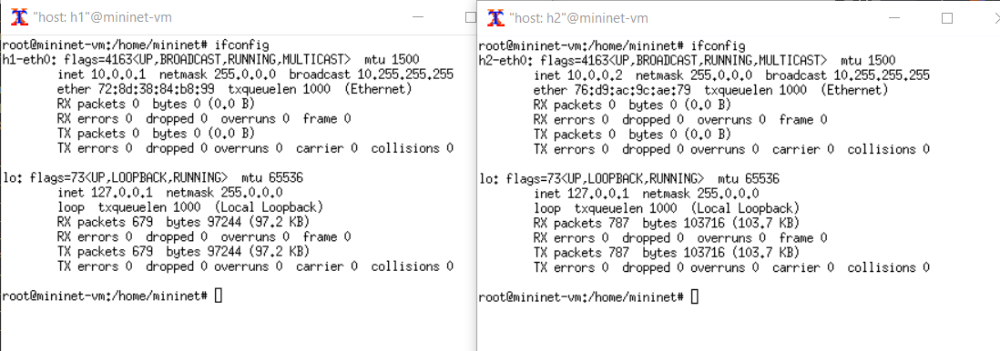{#fig:001 width=70%}

Проверим подключение между хостами h1 и h2 с помощью команды ping
с параметром -c 6 (рис. [-@fig:002]).

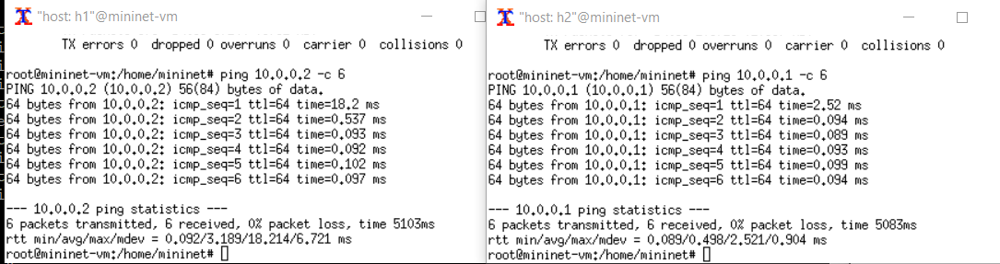{#fig:002 width=70%}

Пакеты могут быть потеряны в процессе передачи из-за таких факторов, как
битовые ошибки и перегрузка сети. Скорость потери данных часто измеряется
как процентная доля потерянных пакетов по отношению к количеству отправленных пакетов.
На хосте h1 добавим 10% потерь пакетов к интерфейсу h1-eth0:

`sudo tc qdisc add dev h1-eth0 root netem loss 10%`

Здесь:

- sudo: выполнить команду с более высокими привилегиями;
- tc: вызвать управление трафиком Linux;
- qdisc: изменить дисциплину очередей сетевого планировщика;
- add: создать новое правило;
- dev h1-eth0: указать интерфейс, на котором будет применяться правило;
- netem: использовать эмулятор сети;
- loss 10%: 10% потерь пакетов.

Проверим, что на соединении от хоста h1 к хосту h2 имеются потери пакетов, используя команду ping с параметром -c 100 с хоста h1. Параметр -c
указывает общее количество пакетов для отправки. (рис. [-@fig:003]).

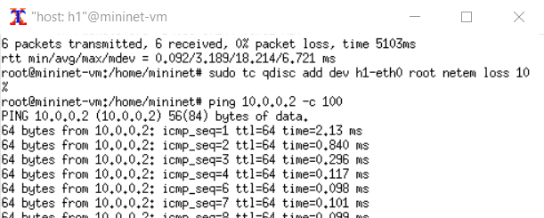{#fig:003 width=70%}

Для эмуляции глобальной сети с потерей пакетов в обоих направлениях
необходимо к соответствующему интерфейсу на хосте h2 также добавить 10%
потерь пакетов.
Проверим, что соединение между хостом h1 и хостом h2 имеет больший процент потерянных данных (10% от хоста h1 к хосту h2 и 10% от хоста h2 к хосту
h1), повторив команду ping с параметром -c 100 на терминале хоста h1 (рис. [-@fig:004]).

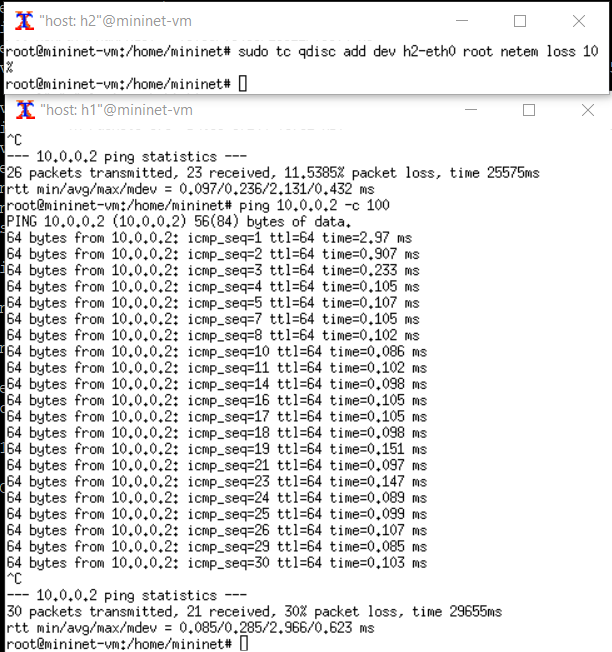{#fig:004 width=70%}

Добавим на интерфейсе узла h1 коэффициент потери пакетов 50% (такой
высокий уровень потери пакетов маловероятен), и каждая последующая
вероятность зависит на 50% от последней:
Проверим, что на соединении от хоста h1 к хосту h2 имеются потери пакетов,
используя команду ping с параметром -c 50 с хоста h1 (рис. [-@fig:005]).

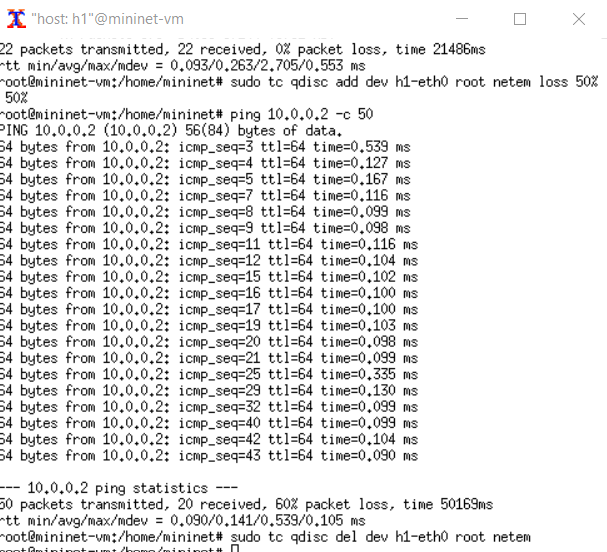{#fig:005 width=70%}

Добавим на интерфейсе узла h1 0,01% повреждения пакетов.
Проверим конфигурацию с помощью инструмента iPerf3 для проверки
повторных передач (рис. [-@fig:006]).

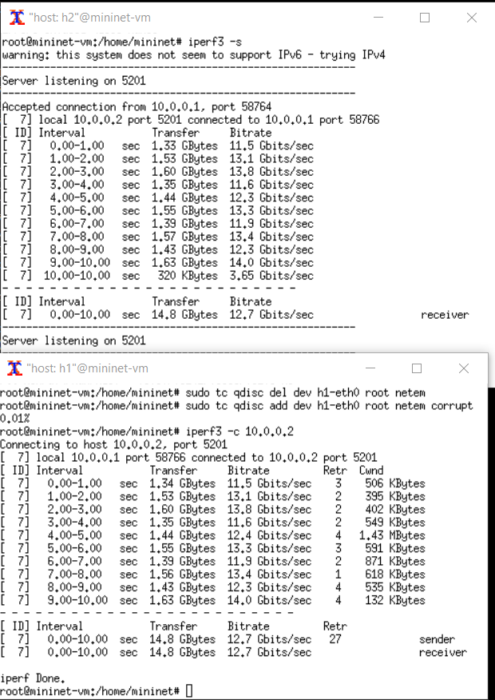{#fig:006 width=70%}

Добавим на интерфейсе узла h1 следующее правило: 25% пакетов (со значением корреляции 50%) будут отправлены немедленно, а остальные 75% будут задержаны на 10 мс. Проверим, что на соединении от хоста h1 к хосту h2 имеются потери пакетов,
используя команду ping с параметром -c 20 с хоста h1. Убедимся, что часть
пакетов не будут иметь задержки (один из четырех, или 25%), а последующие несколько пакетов будут иметь задержку около 10 миллисекунд (три
из четырех, или 75%) (рис. [-@fig:007]).

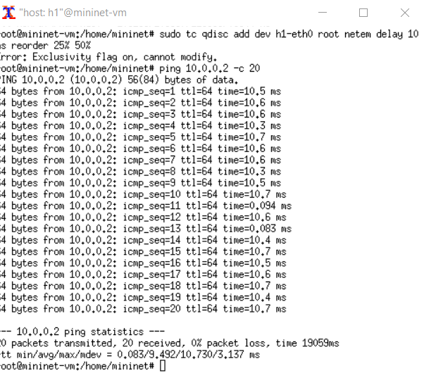{#fig:007 width=70%}

Для интерфейса узла h1 зададим правило c дублированием 50% пакетов (т.е.
50% пакетов должны быть получены дважды):
Проверим, что на соединении от хоста h1 к хосту h2 имеются дублированные
пакеты, используя команду ping с параметром -c 20 с хоста h1. Дубликаты
пакетов помечаются как DUP! (рис. [-@fig:008]).

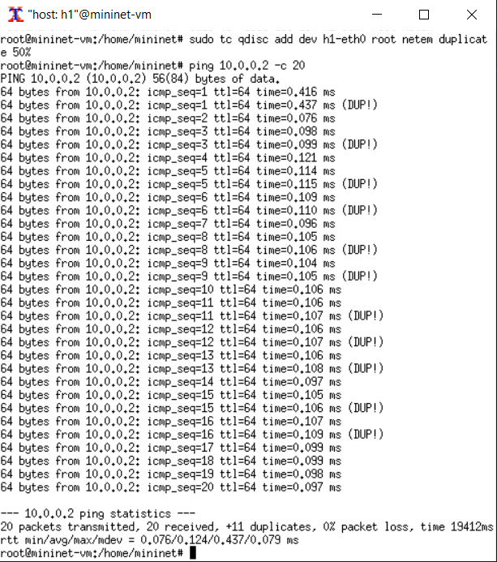{#fig:008 width=70%}

В виртуальной среде mininet в своём рабочем каталоге с проектами создадим
каталог simple-drop и перейдем в него.
Создадим скрипт для эксперимента lab_netem_ii.py (рис. [-@fig:009]).

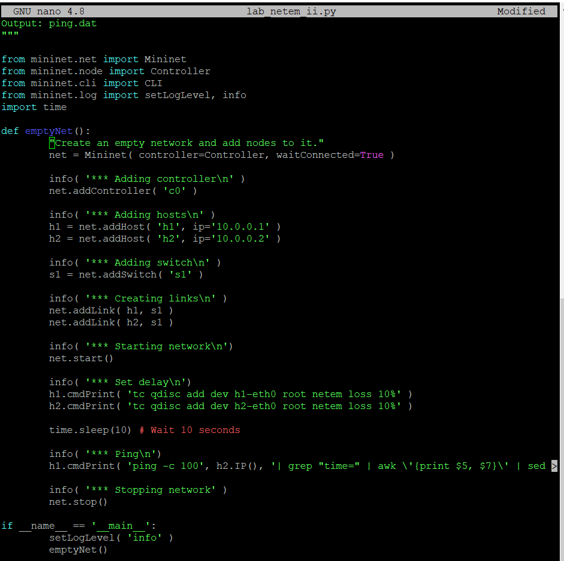{#fig:009 width=70%}

Скорректируем скрипт так, чтобы на экран или в отдельный файл выводилась информация о потерях пакетов (рис. [-@fig:010]).

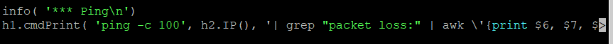{#fig:010 width=70%}

Создадим Makefile для управления процессом проведения эксперимента (рис. [-@fig:011]).

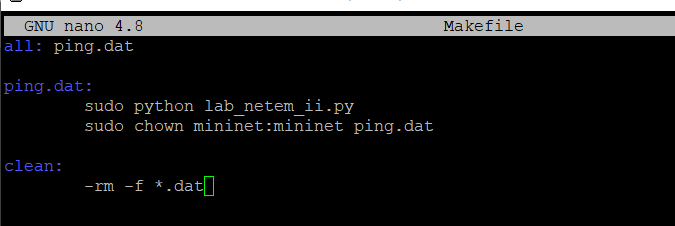{#fig:011 width=70%}

Выполним эксперимент (рис. [-@fig:012]).

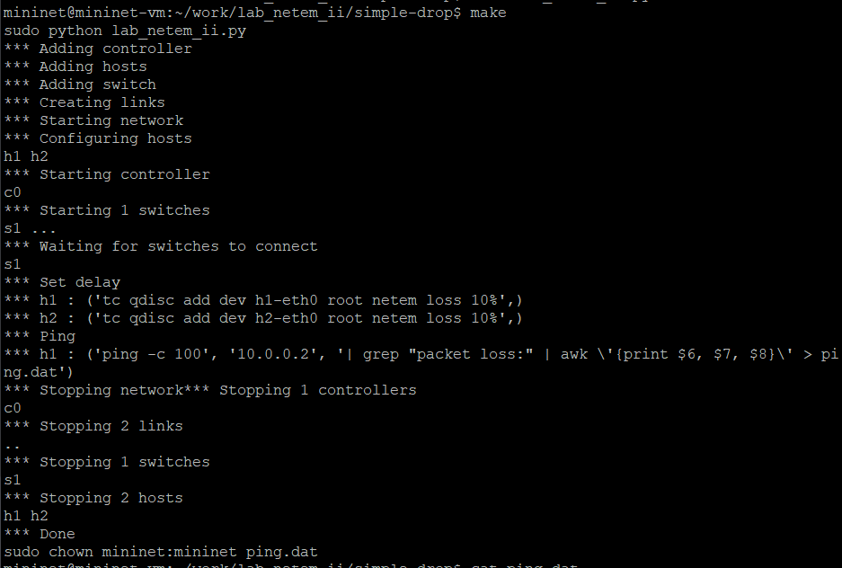{#fig:012 width=70%}

# Выводы

В результате выполнения данной лабораторной работы я получила навыки проведения интерактивных экспериментов в среде Mininet по исследованию параметров сети,
связанных с потерей, дублированием, изменением порядка и повреждением
пакетов при передаче данных.

# Список литературы{.unnumbered}

::: {#refs}
:::
